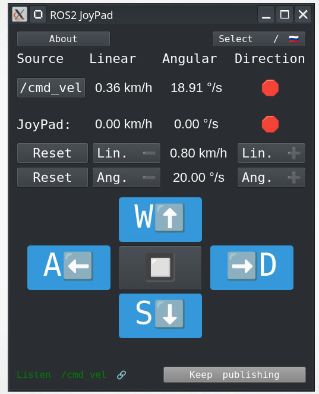

# ROS2 JoyPad



---

English | [Русский](#Описание-русский)

---

## English Description
**ROS2 JoyPad** is a user-friendly application for controlling a robot through ROS2. It allows real-time control of linear and angular velocity (Z-axis) using both keyboard input and application buttons.


### 🚀 Features:
- Control robot movement and rotation.
- Support for both keyboard and on-screen buttons.
- Changeable topic for velocity control (`/cmd_vel` by default).
- Simultaneous control via keyboard and UI buttons.
- Real-time speed adjustment.
- Active control only while a key is held.
- `/cmd_vel` monitoring and connection status check.
- Multilingual interface support.

### 🔧 Installation & Run:
```bash
# Install dependencies
sudo apt update && sudo apt install python3-pyqt5 ros-humble-rclpy

# Run the application
ros2 run ros2_joypad joypad_node
```

### 🔗 Topic connection test:
```bash
ros2 topic echo /cmd_vel
```

📌 **This application is designed for convenient robot control via ROS2.**


## Описание (Русский)
ROS2 JoyPad — это удобное приложение для управления роботом через ROS2. Оно позволяет контролировать линейную и угловую скорость по оси Z, используя как кнопки приложения, так и клавиатуру.

### 🚀 Возможности:
- Управление движением и поворотами робота.
- Поддержка ввода с клавиатуры и кнопок приложения.
- Возможность изменения топика для управления (`/cmd_vel` по умолчанию).
- Одновременная работа с клавиатурой и интерфейсом приложения.
- Управление скоростью в реальном времени.
- Активное управление только при удержании клавиши.
- Мониторинг состояния `/cmd_vel` и соединения.
- Поддержка многоязычного интерфейса.

### 🔧 Установка и запуск:
```bash
# Установка зависимостей
sudo apt update && sudo apt install python3-pyqt5 ros-humble-rclpy

# Запуск
ros2 run ros2_joypad joypad_node
```

### 🔗 Тест подключения к топику:
```bash
ros2 topic echo /cmd_vel
```

📌 **Приложение разработано для удобства управления роботами через ROS2.**

